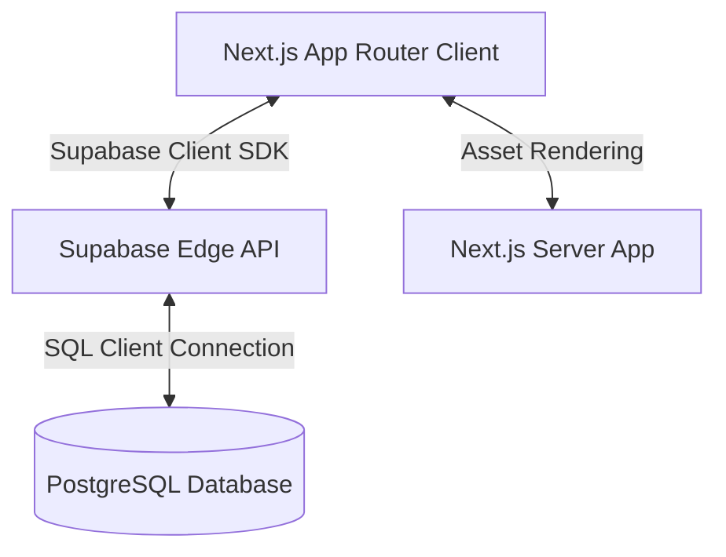
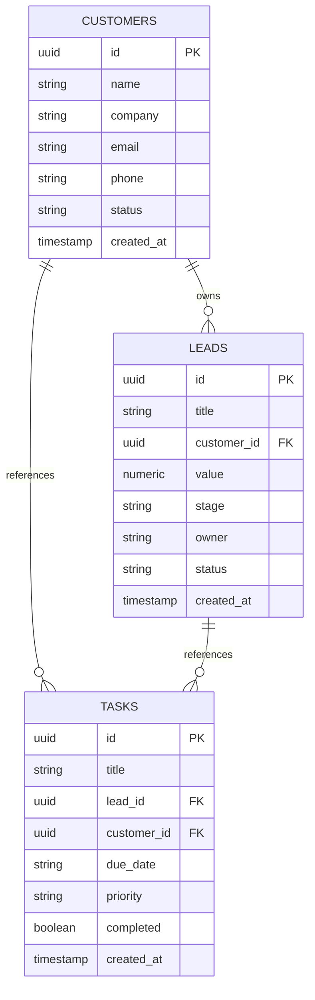
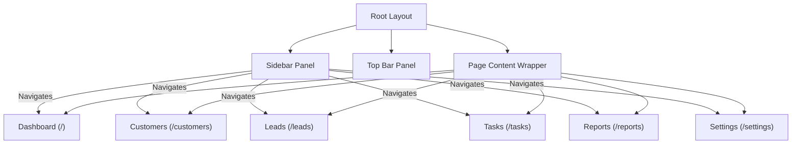

# NexusCRM - Enterprise Customer Relationship Management

NexusCRM is a next-generation, high-performance Customer Relationship Management platform designed for B2B sales teams. Built using Next.js 14 (App Router), TypeScript, Tailwind CSS, and Supabase (PostgreSQL), it offers a fast, visually rich interface to manage customers, track active sales pipelines, schedule action-item tasks, and view revenue analytics.

---

## Feature Overview

1. **Dashboard Overview** - Visual tracking of pipeline metrics, conversion progress, and monthly target stats.
2. **Customer Directory** - An indexed database of corporate clients, status badges, and contact details.
3. **Leads & Pipeline Kanban Board** - Interactive deal staging and real-time sales pipeline management.
4. **Task Management** - Tracking of time-sensitive sales tasks and priority assignments.
5. **Analytics & Reports** - Insights on monthly revenues and product category distribution.
6. **Settings Panel** - Configuration tools for workspace credentials and Supabase database integrations.

---

## System Architecture



---

## Planned Database Schema



---

## Navigation Structure



---

## Supabase Setup Prerequisites

1. **Create a Supabase Project**:
   - Go to [Supabase Console](https://supabase.com) and click **New Project**.
   - Note down the **Project URL** and the **Anon Key** from the settings panel.
2. **Environment Configuration**:
   - Copy `.env.example` to `.env` in the root workspace folder.
   - Insert the values:
     ```env
     NEXT_PUBLIC_SUPABASE_URL=https://your-project-id.supabase.co
     NEXT_PUBLIC_SUPABASE_ANON_KEY=your-anon-key
     ```
3. **Database Migration**:
   - In subsequent commits, SQL schema scripts will be available in `/supabase/migrations/` to construct the tables automatically.
