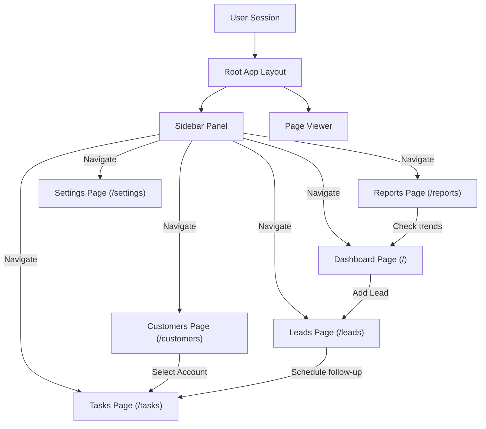

# NexusCRM - Screen Tour & Navigation Map

This tour describes the layout screens available in this initial scaffold version of NexusCRM.

---

## Screen Inventory & Paths

1. **Login Screen (`/login`)**
   - **Main Display**: Center-aligned login card with credential fields (email & password), and sandbox demo bypass controls.
   - **Primary Action**: "Sign In" button or "Explore Demo Sandbox" trigger.

2. **Dashboard Overview (`/`)**
   - **Main Display**: 4 KPI cards (Total Customers count, Open Deals financial value sum, Tasks due today count, and Opportunity Win Rate percentage). Sales funnel bar chart representing financial allocations. Tasks closure donut chart with inner completion percentage display. Customer growth trend line chart using monotone bezier curve mapping.
   - **Recent Activity Feed**: Consolidated listing of the 5 most recent customer creations, task progress updates, and deal changes.
   - **Primary Action**: "New Opportunity" navigation button directing to the Leads Pipeline.

3. **Customers Directory (`/customers`)**
   - **Main Display**: Interactive listings table displaying client names, corporate accounts, contact details, status pills, tags, and action dropdowns. Search inputs filter contacts instantly on keychange, and pagination links traverse pages.
   - **Primary Action**: "Add Customer" button (opens the validation modal), "Edit details" trigger (reveals the slide-over editor), and "Delete client" button (triggers delete warning).
   - **Add Customer Modal**: Pop-up card rendering validated input forms (name, company, email, phone, status, tags, and notes).
   - **Edit Customer Panel**: Slide-over right drawer panel populated with loaded fields to edit records.

3.1. **Customer Detail Page (`/customers/[id]`)**
   - **Main Display**: Customer info header with initials avatar, status badge, email/phone contact links, and custom tags. Chronological activity timeline displaying customer notes, task creation/completion milestones, and deal opportunity stages. Side panel lists related active deals and summary profile notes.
   - **Timeline Interactions**: Interactive checkbox toggling to complete tasks.
   - **Primary Action**: "Add Note" inline form to post interaction logs instantly on the chronological timeline, and "Create New Deal" shortcut link.

4. **Leads Kanban Board (`/leads`)**
   - **Main Display**: 5 columns grouping deal stages (New, Contacted, Qualified, Proposal, Closed) with dynamically aggregated values. Individual cards display title, company name, value, target date, and closing probability.
   - **Drag & Drop Interactions**: Representatives drag cards between columns to change opportunity stages. The interface leverages `@dnd-kit` mouse distance sensors to differentiate drag intents from simple card clicks.
   - **Alternative List View**: Toggles the Kanban interface into a clean tabular data list presenting opportunity properties.
   - **Primary Action**: "Create Deal" button (opens Zod-validated creation modal), card action controls (opens edit modals or delete prompts).

5. **Tasks Checklist (`/tasks`)**
   - **Main Display**: Checklist item rows displaying complete status checkbox, linked customer profiles, linked deal names, target due dates, priority level pills, and assignee profile avatars.
   - **Interactive Elements**: Overdue, incomplete tasks are marked with bold red borders and warning pills.
   - **Filter Controls**: Search input matches task details, tabs filter by status (Active, Completed, All), and buttons switch priority tiers (All, Low, Medium, High).
   - **Primary Action**: "New Task" button to open Zod-validated modal form, checklist toggles to toggle complete states, and delete action triggers.

6. **Reports & Analytics (`/reports`)**
   - **Main Display**: Bar charts reflecting monthly revenue progression and category breakdowns.
   - **Primary Action**: Custom date selector dropdown.

7. **Settings/Profile Screen (`/settings`)**
   - **Main Display**: Profile parameters forms to edit display names and avatar links, active database connection markers, security access profiles.
   - **Primary Action**: Left-hand tab switcher and "Save Changes" action to update user auth sessions.

---

## Screen Navigation Map

