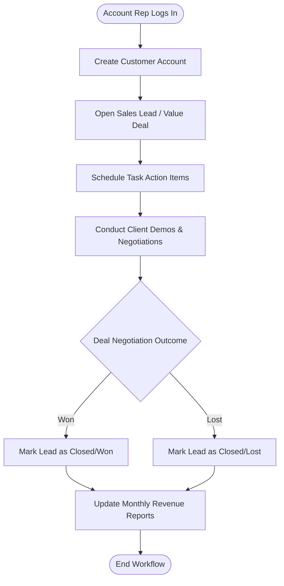

# NexusCRM - Platform Walkthrough & User Workflow

This walkthrough provides a conceptual explanation of NexusCRM, its current feature status, and the operational workflow followed by B2B sales representatives.

---

## What is a CRM and Who Uses It?

A **Customer Relationship Management (CRM)** platform is a software system designed to store, manage, and optimize all relationship touchpoints between a business and its current or potential customers. 

### Core Users:
- **Sales Representatives**: To track prospects, follow up on deals, log tasks, and monitor active leads.
- **Sales Managers**: To inspect pipeline volume, deal values, and representative conversion rates.
- **Account Managers**: To manage customer profiles, update accounts, and check status parameters.
- **Operations & Administrators**: To configure system inputs, database hooks, and workspace profiles.

---

## Feature Overview

| Feature Module | Description | Status |
| :--- | :--- | :--- |
| **Dashboard Metrics** | Consolidated view of customer counts, active leads, tasks, and sales value. | 🚧 UI Scaffold (Static Mock) |
| **Customer Directory** | A central repository for company accounts, email records, and phones. | 🚧 UI Scaffold (Static Mock) |
| **Leads Kanban Board** | Visual board organizing deals by sales stages (New, Proposal, Negotiation). | 🚧 UI Scaffold (Static Mock) |
| **Task Scheduler** | Focus-oriented tracker for pending tasks, alerts, and customer check-ins. | 🚧 UI Scaffold (Static Mock) |
| **Reports & Charts** | Bar graphs representing revenue progression and category breakdowns. | 🚧 UI Scaffold (Static Mock) |
| **Settings Panel** | Form panels to manage user accounts and database connection credentials. | 🚧 UI Scaffold (Static Mock) |

*(Note: 🚧 indicates that frontend layout interfaces are established, with database sync operations and interactive hooks planned for future commits)*

---

## User Workflow Diagram

